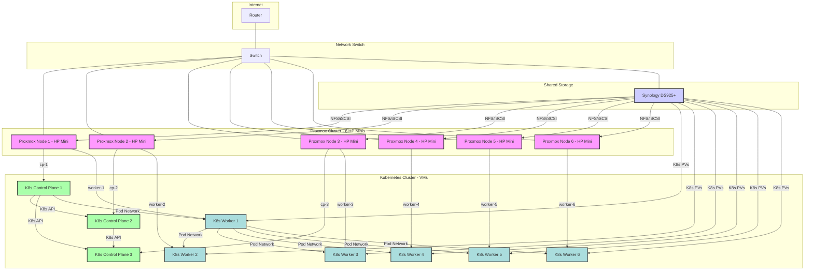

### Simple Diagram: Proxmox + K8s + Synology

**Explanation of the Diagram:**

*   **Internet & Router:** Your gateway to the outside world.
*   **Network Switch:** The central hub connecting everything.
*   **Proxmox Nodes (HP Minis):** Your 6 physical machines, each running Proxmox VE. They form a single Proxmox cluster.
*   **Synology DS925+:** Your NAS, connected to the switch. It provides shared storage (NFS/iSCSI) to all Proxmox nodes.
*   **Kubernetes Control Plane VMs (K8sCP1-3):** Three VMs, each running on a different physical Proxmox node (PVE1-3) for high availability. They communicate with each other and the worker nodes.
*   **Kubernetes Worker VMs (K8sW1-6):** Six VMs, one on each physical Proxmox node (PVE1-6). These run your actual applications (pods).
*   **Connections:**
    *   All physical devices connect to the **Switch**.
    *   Proxmox nodes communicate with each other for **cluster management** and **VM migration**.
    *   Proxmox nodes access the **Synology** for VM storage.
    *   Kubernetes VMs communicate over the **Pod Network**.
    *   Kubernetes Worker VMs access the **Synology** for Persistent Volumes (PVs) for stateful applications.
